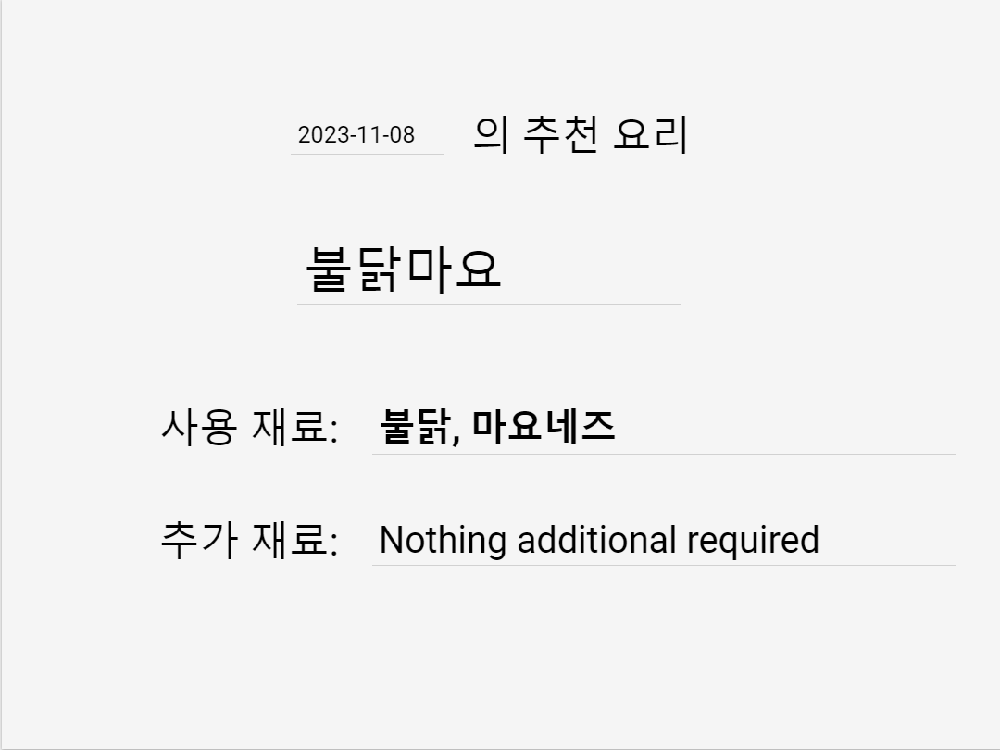

# 냉장고 시각화 프로젝트

## 목적

1. BigQuery 이용

2. ChatGpt 이용

3. 1과 2로 인하여 프로젝트 고도화

## HOW

- poetry and python
```
  poetry shell
  python main.py
```

## 결과 확인

[냉장고 시각화](https://lookerstudio.google.com/reporting/52db616e-8ccf-4b45-bc2a-e2ed2b4b4530)

